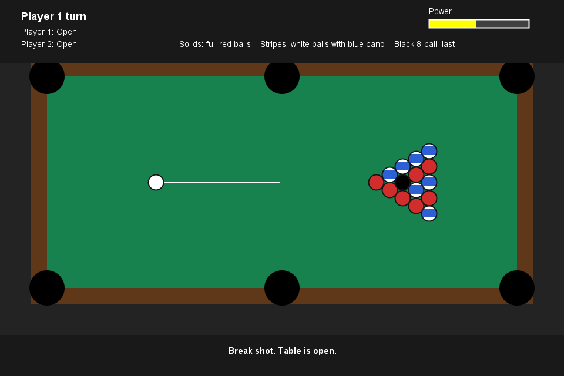

# Java 8-Ball Pool

A two-player 8-ball billiards game built in Java Swing. The project focuses on core gameplay, smooth 2D physics, clear rules, and simple object-oriented structure.



## Project Overview

This game simulates a basic 8-ball pool match on a digital table. Players take turns aiming and shooting the cue ball, trying to pocket their assigned group before legally pocketing the 8-ball.

To make the game easy to understand visually:

- Solids are full red balls.
- Stripes are white balls with a blue band.
- The 8-ball is black.
- The cue ball is white.

## Features

- Two-player turn system
- Open-table start
- Automatic solids/stripes assignment
- Legal and illegal 8-ball handling
- Scratch detection
- Ball-in-hand after fouls
- Pocket detection for all six pockets
- Cue aiming and power control
- Mouse and keyboard controls
- Collision physics between balls
- Cushion bounce physics
- Friction-based slowdown
- Simple Swing menu and rules screen

## How To Run

From the project root:

```powershell
javac -d billards\bin billards\src\project\*.java
java -cp billards\bin project.Main
```

The main class is:

```text
project.Main
```

## Controls

- Mouse movement: aim
- Mouse drag/release: shoot
- Left/Right arrows: fine aim adjustment
- Up/Down arrows: adjust shot power
- Space/Enter: shoot or place cue ball during ball-in-hand
- R: restart with a new rack

## Game Rules Implemented

- The table starts open.
- The first legal solid or stripe pocketed assigns the groups.
- A player must pocket all balls in their group before shooting the 8-ball.
- Pocketing the 8-ball early loses the game.
- Pocketing the 8-ball legally wins the game.
- A foul gives the opponent ball-in-hand.

Fouls include:

- Scratching the cue ball
- Missing every object ball
- Hitting the wrong group first
- Hitting no rail and pocketing no ball after contact

## Project Structure

```text
billards/
  src/project/
    Main.java        Starts the Swing application
    GameMenu.java    Main menu and rules screen
    GamePanel.java   Game loop, rendering, input, physics, and rules
    Ball.java        Ball state and drawing
    BallGroup.java   Cue, solid, stripe, 8-ball, and unassigned groups
    Player.java      Player name and assigned group
  bin/project/       Compiled class files
```

## OOP Concepts Used

The project uses a small object-oriented design:

- `Ball` stores position, velocity, color, radius, group, and pocket state.
- `BallGroup` separates cue, solid, stripe, 8-ball, and unassigned states.
- `Player` stores each player's name and assigned ball group.
- `GamePanel` coordinates the game loop, physics, input, rule checking, and drawing.
- `GameMenu` separates the start/rules UI from gameplay.
- `Main` handles the application window and screen navigation.

This keeps the game logic easier to extend than putting everything in one class.

## Physics Explanation

The physics system is custom-built using simple 2D vector math.

Each ball has:

- `x`, `y` position
- `vx`, `vy` velocity
- radius
- pocketed state

Every timer tick:

1. Ball positions update using velocity.
2. Friction reduces velocity slightly.
3. Rail collisions reverse velocity with energy loss.
4. Ball-ball collisions transfer velocity between balls.
5. Pocket checks remove pocketed balls from play.
6. The shot ends once all balls stop moving.

### Friction

Friction slowly reduces each ball's velocity:

```text
velocity = velocity * friction
```

This makes balls gradually slow down instead of moving forever.

### Cushion Bounce

When a ball hits a table edge, the matching velocity direction is reversed and reduced:

```text
vx = -vx * cushionBounce
```

This simulates energy loss when balls hit the rail.

### Ball Collisions

Ball collisions are handled as equal-mass elastic collisions:

- The distance between two ball centers is checked.
- If the distance is less than both radii combined, the balls overlap.
- The collision normal is calculated.
- The balls are separated to prevent sticking.
- Velocity is exchanged along the collision direction.

The game also uses sub-steps for faster shots so balls are less likely to pass through each other at high speed.

### Pocket Detection

Each pocket is stored as a center point. A ball is pocketed when its center gets close enough to a pocket center:

```text
distance(ball, pocket) < pocketRadius
```

Pocket checks happen before rail bounce so balls near pockets fall in naturally instead of bouncing away from pocket edges.

## Design Choices

The visual design is intentionally simple. The goal is functionality and readability:

- Plain table colors
- Clear ball groups
- No tiny ball numbers
- HUD separated from the board
- Simple menu and rules screen

This makes the game easier to test, explain, and improve.

## Possible Future Improvements

- Add sound effects
- Add cue stick animation
- Add AI opponent
- Add shot prediction lines
- Add score history
- Add more official 8-ball rule variations
- Add unit tests for rule validation and physics helpers
